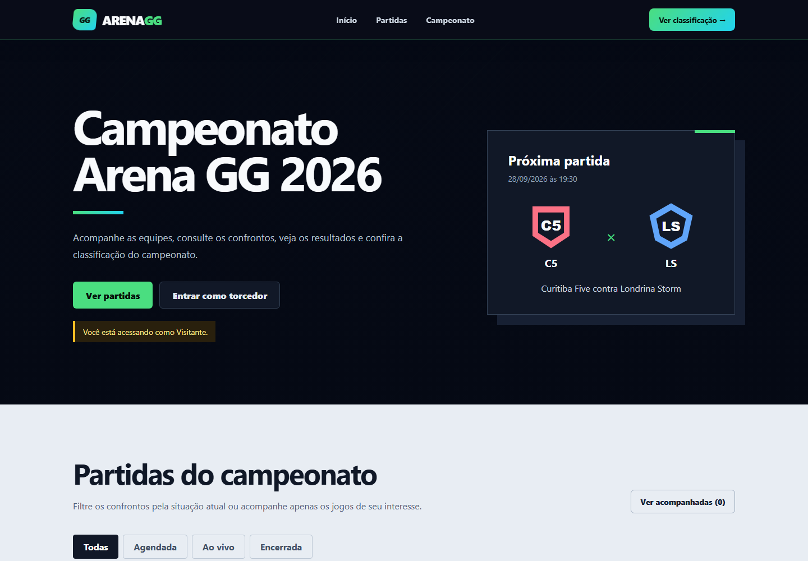
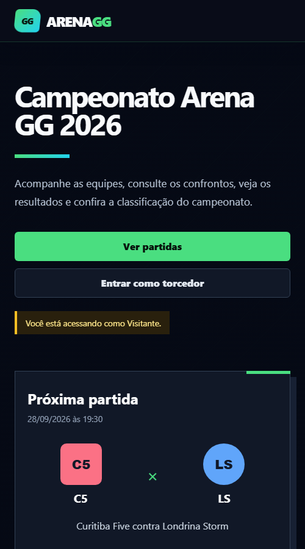

# Arena GG

## Aluno

Eduardo dos Santos Iachinski Sotoriva

## Descrição

O Arena GG é uma aplicação Angular para acompanhar um campeonato universitário de eSports. A página apresenta as equipes participantes, os confrontos, os resultados, a situação de cada partida e a classificação geral da competição.

## Funcionalidades

- Exibição dinâmica de equipes e partidas;
- Identificação de partidas agendadas, ao vivo e encerradas;
- Exibição de placares e resultados;
- Filtro de partidas por situação;
- Seleção de partidas para acompanhamento;
- Visualização dos detalhes e mapas de cada confronto;
- Registro fictício de palpites em partidas disponíveis;
- Classificação geral das equipes;
- Entrada e saída fictícia da área do torcedor;
- Layout responsivo para computadores e dispositivos móveis.

## Conteúdos Angular aplicados

- Componentes para cabeçalho, cards de partidas, classificação e rodapé;
- Interpolação para exibir textos, datas, placares e estatísticas;
- Property Binding nas imagens, classes, atributos e estado dos botões;
- Event Binding nos filtros e botões de interação;
- Diretivas `@if`, `@else` e `@for` para controlar a interface;
- Comunicação entre componentes com `@Input`, `@Output` e `EventEmitter`.

## Tecnologias

- Angular 21;
- TypeScript;
- HTML;
- CSS;
- Vitest.

## Como executar

1. Clone este repositório.
2. Abra um terminal na pasta do projeto.
3. Execute `npm install`.
4. Execute `npm start` ou `ng serve`.
5. Acesse `http://localhost:4200` no navegador.

## Imagens da aplicação

### Versão para computador

### Versão responsiva

## Vídeo

https://youtu.be/ScfwuaxzJPA
